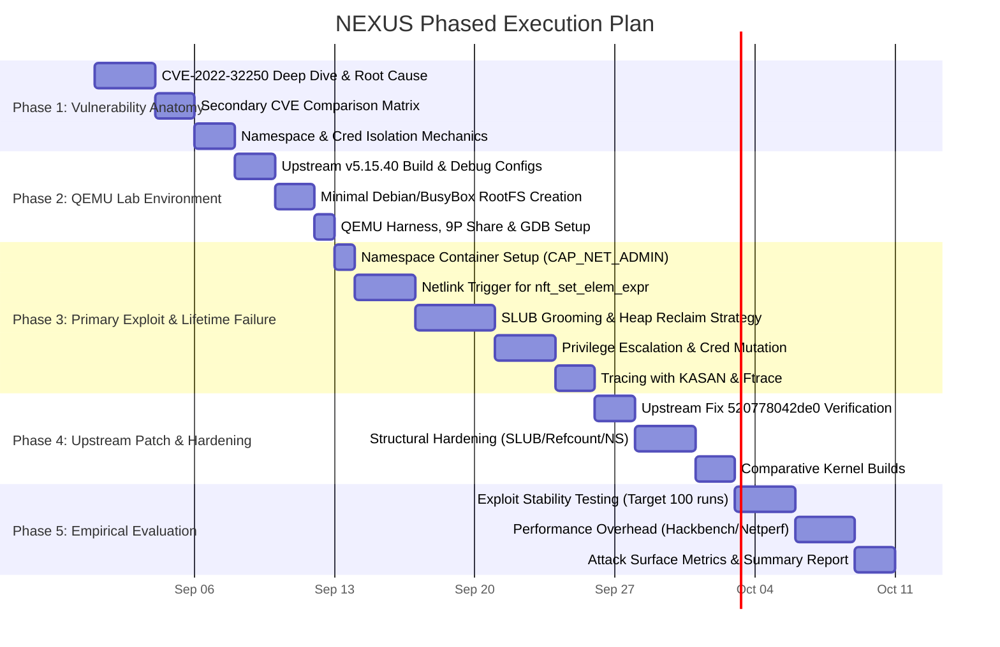
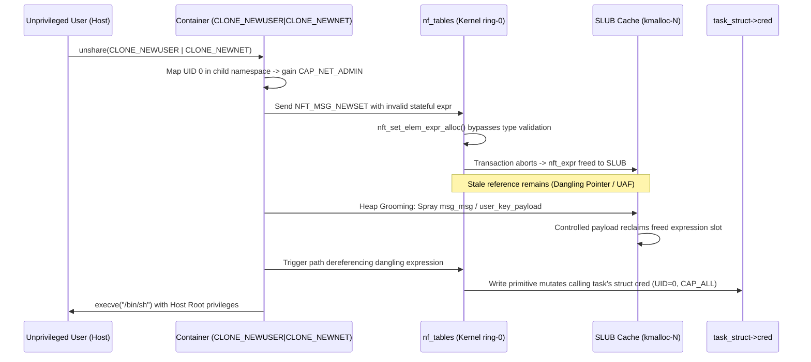

# NEXUS: Kernel Object Lifetime & Container Escape Research

A focused kernel security research project analyzing use-after-free (UAF) vulnerabilities in `netfilter/nf_tables` reachable via unprivileged user+network namespaces. Built around **Upstream Linux 5.15 LTS** and **CVE-2022-32250** as the primary research target.

---

## 1. Locked Project Architecture

```
+---------------------------------------------------------------------------------------------------------+
|                                           NEXUS Core Narrative                                          |
|                                                                                                         |
|  Linux 5.15 LTS                                                                                         |
|       │                                                                                                 |
|       ▼                                                                                                 |
|  Unprivileged User+Network Namespace (CLONE_NEWUSER | CLONE_NEWNET)                                     |
|       │                                                                                                 |
|       ▼                                                                                                 |
|  nf_tables Netlink Subsystem (CAP_NET_ADMIN in child namespace)                                          |
|       │                                                                                                 |
|       ▼                                                                                                 |
|  CVE-2022-32250 (nft_set_elem_expr_alloc type check inversion)                                          |
|       │                                                                                                 |
|       ▼                                                                                                 |
|  Kernel Object Lifetime Failure (SLUB UAF on nft_expr / kmalloc)                                        |
|       │                                                                                                 |
|       ▼                                                                                                 |
|  Isolation Violation & Credential Mutation (struct cred / privilege escalation)                         |
|       │                                                                                                 |
|       ▼                                                                                                 |
|  Upstream Point Fix vs. NEXUS Structural Hardening (RCU / SLUB / Namespace gating)                      |
|       │                                                                                                 |
|       ▼                                                                                                 |
|  Empirical Benchmarking (Measured Exploit Stability vs. Performance Overhead)                           |
+---------------------------------------------------------------------------------------------------------+
```

### 1.1 Kernel Specification
* **Baseline (Vulnerable) Kernel:** Upstream Linux kernel pinned to tag **`v5.15.40`** (or `v5.15.0` vanilla upstream git commit).
  * **Why Upstream 5.15 LTS:**
    * Clean, reproducible upstream git history without distribution-specific patch skew.
    * Direct source-level diffing between unpatched commit and upstream fix commit `520778042de0`.
    * Native compatibility with established debugging tools (GDB Python scripts, KASAN, ftrace, SLUB debug).
    * Lightweight, fast QEMU boot times with minimal initramfs.
* **Patched Comparison Kernel:** Linux 5.15 with upstream patch `520778042de0` applied.
* **Hardened Target Kernel:** Linux 5.15 with active structural mitigations (`CONFIG_REFCOUNT_FULL`, `CONFIG_SLAB_FREELIST_HARDENED`, randomized SLUB caches, namespace netfilter restrictions).

---

### 1.2 CVE Hierarchy & Research Scoping

| Tier | CVE ID | Subsystem | Role in NEXUS |
| :--- | :--- | :--- | :--- |
| 🥇 **Primary** | **CVE-2022-32250** | `netfilter: nf_tables` (`nft_set_elem_expr_alloc`) | **Core Research Focus**: Full end-to-end vulnerability analysis, heap grooming model, privilege escalation analysis, point-fix validation, and overhead profiling. |
| 🥈 **Secondary** | **CVE-2023-32233** | `netfilter: nf_tables` (Anonymous sets / batch) | **Comparative Target 1**: Evaluates how batch transaction lifecycle bugs differ from expression allocation bugs under the same SLUB allocator. |
| 🥉 **Secondary** | **CVE-2024-1086** | `netfilter: nf_tables` (Verdict drop error handling) | **Comparative Target 2**: Explores page-table / modern primitive differences vs. classic SLUB UAF. |
| 🔬 **Research Option** | **CVE-2025-38617** | `net/packet` (`af_packet` ring race) | **Cross-Subsystem Comparison**: Contrasts deterministic netlink logic flaws with asynchronous network socket races. |
| 🔮 **Future / Optional**| **CVE-2026-23111** | `netfilter: nf_tables` (`nft_map_catchall`) | **Lifecycle Reference**: Modern catchall refcount underflow analysis. |

---

## 2. Research Phases



---

## Phase 1: CVE-2022-32250 Anatomy & Vulnerability Deep Dive

### 1.1 Technical Mechanics
* **Location:** `net/netfilter/nf_tables_api.c` → `nft_set_elem_expr_alloc()`
* **Bug Class:** Type-confusion leading to use-after-free (UAF) in the SLUB allocator.
* **Mechanism:**
  1. During netlink set creation (`NFT_MSG_NEWSET` / `NFT_MSG_NEWSETELEM`), userspace can supply expressions.
  2. The kernel checks whether the expression is stateful. Due to improper ordering / validation of `expr->ops->type->flags`, an invalid/non-stateful expression passes validation.
  3. When the transaction fails or aborts, the cleanup path invokes `nft_expr_destroy()` on uninitialized or improper expression data.
  4. The backing memory slot is freed to the SLUB cache (`kmalloc-*`), but references remain in transaction lists or dangling pointers, enabling subsequent reuse-after-free.

### 1.2 Comparative Analysis
We document the structural differences across our primary and secondary CVEs:

| Metric | Primary: CVE-2022-32250 | Secondary: CVE-2023-32233 | Secondary: CVE-2024-1086 |
| :--- | :--- | :--- | :--- |
| **Vulnerable Object** | `struct nft_expr` | `struct nft_set` (anonymous) | `struct sk_buff` / packet data |
| **SLUB Cache Target** | `kmalloc-64` / `kmalloc-128` | `kmalloc-256` / `kmalloc-512` | `kmalloc-1k` / page allocator |
| **Trigger Nature** | Deterministic transaction abort | Batch generation lookup order | Positive verdict return code |
| **Primitive Gained** | Controlled SLUB reuse | Arbitrary batch lookup/write | Page directory / PTE corruption |

---

## Phase 2: Reproducible Upstream QEMU Environment

### 2.1 Pinned Kernel Build
* Source repository: `git://git.kernel.org/pub/scm/linux/kernel/git/stable/linux.git`
* Pinned Baseline Tag: **`v5.15.40`**
* Build targets:
  1. `linux-5.15-baseline` (Unpatched, standard configs)
  2. `linux-5.15-kasan` (Unpatched, `CONFIG_KASAN=y`, `CONFIG_SLUB_DEBUG=y` for error diagnostics)
  3. `linux-5.15-patched` (Upstream commit `520778042de0` applied)
  4. `linux-5.15-hardened` (Patched + `CONFIG_REFCOUNT_FULL=y`, `CONFIG_SLAB_FREELIST_HARDENED=y`, namespace restrictions)

### 2.2 Kernel Config Profile (`env/kernel/nexus_5.15.config`)
```ini
# Core Architecture & Virtualization
CONFIG_64BIT=y
CONFIG_X86_64=y
CONFIG_VIRTIO=y
CONFIG_VIRTIO_PCI=y
CONFIG_VIRTIO_NET=y
CONFIG_VIRTIO_BLK=y
CONFIG_NET_9P=y
CONFIG_NET_9P_VIRTIO=y
CONFIG_9P_FS=y
CONFIG_EXT4_FS=y

# Namespaces (Required for unprivileged container emulation)
CONFIG_NAMESPACES=y
CONFIG_USER_NS=y
CONFIG_NET_NS=y
CONFIG_PID_NS=y
CONFIG_IPC_NS=y

# Netfilter Subsystem
CONFIG_NETFILTER=y
CONFIG_NETFILTER_ADVANCED=y
CONFIG_NF_TABLES=y
CONFIG_NF_TABLES_INET=y
CONFIG_NF_TABLES_IPV4=y
CONFIG_NF_TABLES_IPV6=y
CONFIG_NETFILTER_NETLINK=y
CONFIG_NFT_COMPAT=y

# Debugging & Tracing (Toggled per build)
CONFIG_DEBUG_INFO=y
CONFIG_GDB_SCRIPTS=y
CONFIG_FRAME_POINTER=y
CONFIG_FTRACE=y
CONFIG_FUNCTION_TRACER=y
CONFIG_DYNAMIC_FTRACE=y
```

### 2.3 RootFS & QEMU Harness
* RootFS: Minimal Debian Bullseye/Bookworm generated via `debootstrap` (or Busybox), containing `libmnl-dev`, `libnftnl-dev`, `gcc`, `make`, `gdb`, and `iproute2`.
* QEMU Command:
  ```bash
  qemu-system-x86_64 \
      -enable-kvm -m 2G -smp 2 -cpu host \
      -kernel ./bzImage \
      -drive file=./rootfs.ext4,format=raw,if=virtio \
      -append "root=/dev/vda rw console=ttyS0 nokaslr panic=1 oops=panic" \
      -nographic -serial mon:stdio \
      -netdev user,id=net0,hostfwd=tcp::2222-:22 \
      -device virtio-net-pci,netdev=net0 \
      -virtfs local,path=./share,mount_tag=hostshare,security_model=none,id=hostshare
  ```

---

## Phase 3: CVE-2022-32250 Exploit Development & Tracing

### 3.1 Step-by-Step Exploit Architecture



### 3.2 Key Exploit Modules
1. `exploit/common/namespace_setup.c`: Handles user/net namespace creation, UID mapping (`/proc/self/uid_map`), and verification of `CAP_NET_ADMIN`.
2. `exploit/cve_2022_32250/trigger.c`: Crafts raw Netlink messages to instantiate the malicious set element and trigger the transaction abort path.
3. `exploit/common/heap_groom.c`: Implements size-matched SLUB spraying (using `msg_msg`, `user_key_payload`, or socket buffers) to reliably reclaim the target slot.
4. `exploit/cve_2022_32250/cred_mod.c`: Leverages the corrupted object dereference to locate and overwrite `struct cred` fields (`uid`, `gid`, `cap_effective`, `cap_permitted`).

### 3.3 Diagnostic Tracing
* **KASAN Verification:** Execute trigger on `linux-5.15-kasan` to capture shadow memory reports pinpointing the exact allocation and free stack traces in `nft_set_elem_expr_alloc()`.
* **Ftrace Logging:** Trace function call graph through `nf_tables_newset` → `nft_set_elem_expr_alloc` → `nft_expr_destroy` → `kfree`.

---

## Phase 4: Mitigation Engineering & Hardening

### 4.1 Upstream Fix (`patches/0001-fix-cve-2022-32250-upstream.patch`)
* Port upstream commit `520778042de0` ("netfilter: nf_tables: disallow expressions in sets that are not stateful").
* Ensures expressions are strictly verified before allocation/initialization routines begin.

### 4.2 NEXUS Structural Defenses
1. **Allocator Isolation (`patches/0010-dedicated-nft-kmem-cache.patch`):**
   * Move `nft_expr` and `nft_set` allocations out of general `kmalloc-*` slabs into isolated caches (`kmem_cache_create("nft_expr_jar", ...)`).
   * **Defense:** Cross-type heap spraying (e.g., reclaiming with `msg_msg` or `user_key_payload`) becomes impossible because freed slots cannot be claimed by other object types.
2. **Refcount & Lifetime Hardening (`CONFIG_REFCOUNT_FULL=y`):**
   * Enforce strict saturation arithmetic and underflow traps across all kernel reference-counter primitives.
3. **Namespace Access Gate (`patches/0020-restrict-userns-nftables.patch`):**
   * Implement a sysctl (`net.netfilter.nf_tables_require_init_userns`) requiring `CAP_NET_ADMIN` in the root namespace (`init_user_ns`) to instantiate tables/sets, eliminating the unprivileged attack surface entirely for hardened deployments.

---

## Phase 5: Empirical Evaluation & Benchmarking

> [!NOTE]
> **Methodology Rule:** Exploit success rates and mitigation effectiveness are **empirical metrics to be measured**, not assumptions. We will run automated test batteries and report actual percentages.

### 5.1 Evaluation Matrix

| Metric | Target / Benchmark Tool | Baseline (v5.15.40) | Upstream Patched | NEXUS Hardened |
| :--- | :--- | :--- | :--- | :--- |
| **Exploit Success Rate** | 100 automated iterations (`bench/exploit_stability.sh`) | Measured (%) | Target: 0% | Target: 0% |
| **Crash / Panic Rate** | 100 automated iterations | Measured (%) | Target: 0% | Target: 0% |
| **Scheduler Latency** | `hackbench -s 4096 -l 1000 -g 10` | Baseline (ms) | Measured (Δ%) | Measured (Δ%) |
| **Network Throughput** | `netperf` / `iperf3` (TCP/UDP stream) | Baseline (Gbps) | Measured (Δ%) | Measured (Δ%) |
| **Syscall Overhead** | Netlink transaction round-trip loop (10,000 ops) | Baseline (μs) | Measured (Δ%) | Measured (Δ%) |
| **Unprivileged Surface** | NFNL command acceptance matrix | All allowed | All allowed | Gated / Filtered |

---

## Project Directory Layout

```
NEXUS/
├── docs/
│   ├── CVE-2022-32250-deep-dive.md     # Primary target anatomy & root cause
│   ├── comparative-cve-matrix.md       # Comparison with 2023-32233, 2024-1086, etc.
│   ├── userns-attack-surface.md        # User namespace privilege grant mechanics
│   └── struct-cred-mechanics.md        # Credential structure mutation analysis
├── env/
│   ├── kernel/
│   │   ├── build_kernel.sh             # Upstream 5.15.40 checkout & build automation
│   │   ├── nexus_5.15.config           # Base minimal configuration
│   │   └── nexus_hardened.config       # Mitigation overlay configuration
│   ├── rootfs/
│   │   ├── create_rootfs.sh            # Debootstrap / rootfs generator
│   │   └── overlay/                    # Setup scripts & sysctl configs
│   ├── run_qemu.sh                     # QEMU launcher with 9P & networking
│   └── gdb_attach.sh                   # Remote GDB connection helper
├── exploit/
│   ├── common/
│   │   ├── namespace_setup.c / .h      # unshare & UID/GID mapping
│   │   ├── netlink_helpers.c / .h      # nfnetlink transaction builder
│   │   └── heap_groom.c / .h           # SLUB spray primitives (msg_msg, etc.)
│   ├── cve_2022_32250/
│   │   ├── trigger.c                   # Core vulnerability trigger
│   │   ├── exploit.c                   # End-to-end LPE exploit driver
│   │   └── Makefile
│   └── validate_exploit.sh             # 100-run automated test harness
├── patches/
│   ├── 0001-fix-cve-2022-32250-upstream.patch
│   ├── 0010-dedicated-nft-kmem-cache.patch
│   ├── 0020-restrict-userns-nftables.patch
│   └── apply_patches.sh
├── bench/
│   ├── exploit_stability.sh            # Empirical exploit success rate test
│   ├── run_hackbench.sh                # CPU / scheduler overhead
│   ├── run_netperf.sh                  # Network stack throughput
│   └── run_syscall_overhead.sh         # Netlink round-trip latency
├── results/
│   ├── traces/                         # KASAN logs, ftrace logs, dmesg
│   ├── benchmarks/                     # Raw CSV benchmark outputs
│   └── summary.md                      # Final empirical evaluation report
└── README.md
```

---

## Verification Plan

### Automated Execution
1. **Lab Bring-Up:**
   ```bash
   make -C env build-all  # Clones v5.15.40, builds baseline, patched, and hardened bzImages
   ./env/run_qemu.sh      # Boots QEMU with baseline kernel
   ```
2. **KASAN Detection Verification:**
   - Run trigger inside `linux-5.15-kasan` guest; verify `dmesg` records `BUG: KASAN: slab-use-after-free` in `nft_set_elem_expr_alloc`.
3. **Exploit Stability Measurement:**
   ```bash
   ./bench/exploit_stability.sh --runs 100 --kernel baseline
   ./bench/exploit_stability.sh --runs 100 --kernel patched
   ./bench/exploit_stability.sh --runs 100 --kernel hardened
   ```
4. **Performance Overhead Measurement:**
   ```bash
   ./bench/run_hackbench.sh --all
   ./bench/run_netperf.sh --all
   ./bench/run_syscall_overhead.sh --all
   ```

### Manual Verification
- Confirm that unprivileged container user executes exploit and transitions from unprivileged UID to `uid=0(root)` on host.
- Review GDB memory dumps of `struct cred` before and after overwrite.
- Validate that the patched kernel cleanly returns Netlink errors (`-EOPNOTSUPP` / `-EINVAL`) without triggering memory sanitizers.
